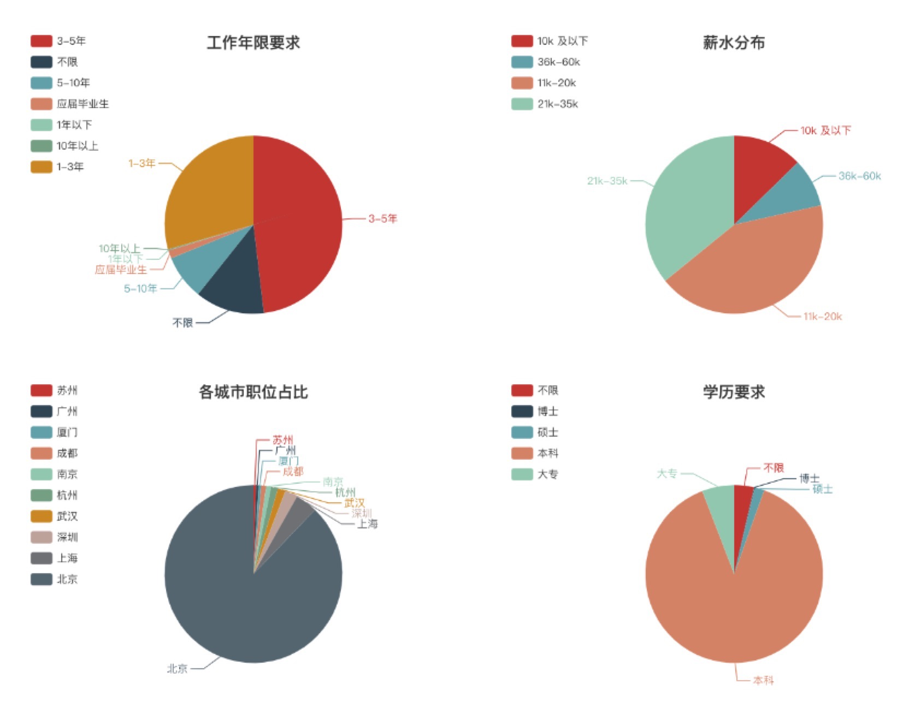

# Lagou Spider

> 如果感谢项目还不错，给个 Star 吧  `_(:з」∠)_`

--|--
---- | ----
Version | 1.0.0
WebSite | http://119.23.223.90/
Source |  https://github.com/GuozhuHe/webspider
Keywords |  `Python3`, `Tornado`, `Celery`, `Spider`, `Lagou`, `Requests`

## 关于本系统

本系统是一个主要使用`python3`, `celery`和`requests`来爬取职位数据的爬虫，实现了定时任务，出错重试，日志记录，自动更改`Cookies`等的功能，并使用`echar.js` + `bootstrap` 来构建前端页面，来展示爬取到的数据。

## 展示页面




## 项目依赖

* `requests`
* `sqlalchemy`
* `python-redis`
* `redis`
* `mysqlclient`
* `lxml`
* `retrying`
* `celery`
* `tornado`

## 安装使用

* 克隆项目

```bash
git clone git@github.com:GuozhuHe/webspider.git
```

* 安装 `virtualenv` (推荐使用方式)
```bash
pip install virtualenv
# 创建 python3 虚拟环境
virtualenv -p /usr/bin/python3 webspider
# 激活虚拟环境
source webspider/bin/activate
```

* 安装 `zc.buildout`
```
pip3 intstall zc.buildout
```

* 在项目根目录下构建
```bash
buildout
# 构建成功后项目的 bin/ 目录下会有可执行脚本
```

* 启动 `redis` 和 `mysql`
```bash
# mac os 环境下
redis-server
mysql.server start
```

* 执行单元测试
```bash
bin/test
```

* 运行 `Web Server`
```bash
bin/web
```

* 运行爬虫程序
```bash
# 启动定时任务分发器
bin/celery_beat
# 启动爬取 职位数据 的 worker(每个月自动执行一次)
bin/celery_lagou_data_worker
# 启动爬取 职位数量 的 worker(每天晚上自动执行一次)
bin/celery_jobs_count_worker 
```

* bin目录下其他可执行脚本
```bash
# 直接爬取职位数量
bin/crawl_jobs_count        
# 直接爬取职位数据
bin/crawl_lagou_data       
# 启动celery监控 
bin/celery_flower            
```

## 其他常见问题
有问题？联系我解决:
* `E-mail`: `heguozhu@zhihu.com`
* `QQ`: `188003202`
