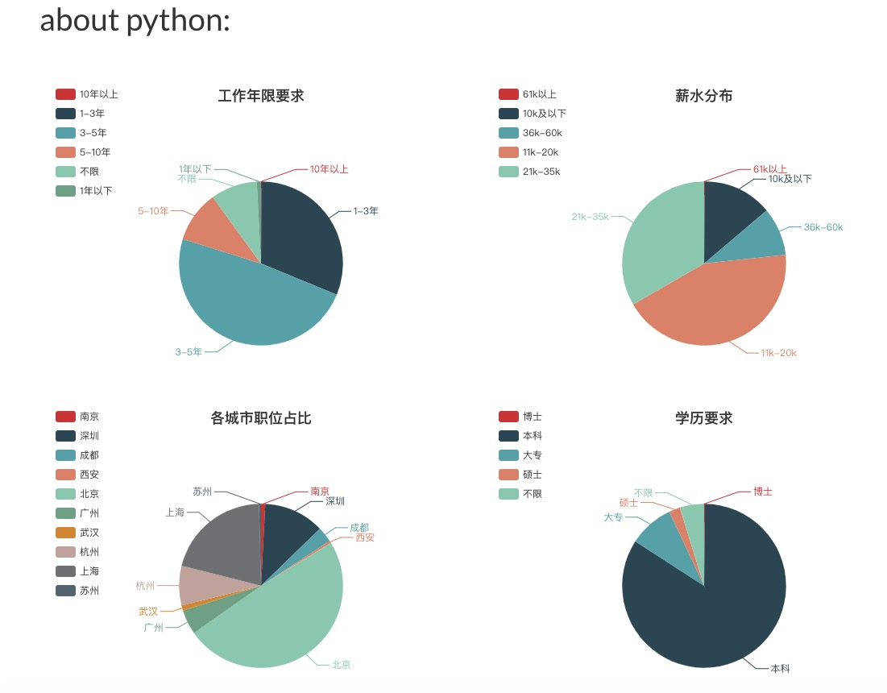

#

[](https://travis-ci.org/JustForFunnnn/webspider)
[](https://codecov.io/gh/JustForFunnnn/webspider)
[](https://landscape.io/github/JustForFunnnn/webspider/master)
[](https://github.com/JustForFunnnn/webspider/blob/master/LICENSE)
[](https://github.com/JustForFunnnn/webspider)

| --       | --                                         |
| -------- | ------------------------------------------ |
| Version  | 1.0.1                                      |
| WebSite  | http://119.23.223.90:8000                  |
| Source   | https://github.com/JustForFunnnn/webspider |
| Keywords | `Python3`, `Tornado`, `Celery`, `Requests` |

## Introduction

This project crawls job&company data from job-seeking websites, cleans the data, modelizes, converts, and stores it in the database. then use [Echarts](https://echarts.apache.org/en/index.html) and [Bootstrap](https://getbootstrap.com/) to build a front-end page to display the IT job statistics, to show the newest requirements and trends of the IT job market.

## Demo

You can input the keyword you are interested in into the search box, such as "Python", then click the search button, and the statistics of this keyword will show.

* The first chart `Years of Working(工作年限要求`) is about the experience requirement of the `Python`, according to the data, the "3 ~ 5 years" is the most frequent requirement, then the following is `1 ~ 3 years`  ([Chart Source Code](https://github.com/JustForFunnnn/webspider/blob/8664fdd135d0ee4322169e484ba9a35bc46032bf/webspider/web/templates/work-year-chart-module.html))

* The second chart `Salary Range(薪水分布`) is about the salary of the `Python`, according to the data,  the "11k ~ 20k" is the most frequent salary provided, then the following is `21k ~ 35k`  ([Chart Source Code](https://github.com/JustForFunnnn/webspider/blob/8664fdd135d0ee4322169e484ba9a35bc46032bf/webspider/web/templates/salary-chart-module.html))

and we also got charts:
* [Education Requirement Data Chart](https://github.com/JustForFunnnn/webspider/blob/8664fdd135d0ee4322169e484ba9a35bc46032bf/webspider/web/templates/education-chart-module.html)
* [City Job Count Chart](https://github.com/JustForFunnnn/webspider/blob/8664fdd135d0ee4322169e484ba9a35bc46032bf/webspider/web/templates/city-jobs-count-chart-module.html)
* [Job Count Change Chart](https://github.com/JustForFunnnn/webspider/blob/8664fdd135d0ee4322169e484ba9a35bc46032bf/webspider/web/templates/per-day-jobs-count-chart-module.html)
* [Company Finance Stage Chart](https://github.com/JustForFunnnn/webspider/blob/8664fdd135d0ee4322169e484ba9a35bc46032bf/webspider/web/templates/finance-stage-chart-module.html)

Python Charts Example:



## Quick Start
> This tutorial is based on `Linux - Ubuntu`, for other systems, please find the corresponding command

* Clone the project

```bash
git clone git@github.com:JustForFunnnn/webspider.git
```

* Install `MySQL`, `Redis`, `Python3`

```bash
# install Redis
apt-get install redis-server

# run Redis in background
nohup redis-server &

# install Python3
apt-get install python3

# install MySQL
apt-get install mysql-server

# start MySQL
sudo service mysql start
```

* Config database and table
```
# create database
CREATE DATABASE `spider` CHARACTER SET utf8mb4 COLLATE utf8mb4_unicode_ci;
```
We still need to create the tables, copy the table definition SQL from `tests/schema.sql` and run it in MySQL

* Build project
```bash
# after a successful build, some executable jobs will be generated under the path env/bin 
make
```

* Run unit-test
```bash
make test
```

* Run code style check
```bash
make flake8
```

* Start web service
```bash
env/bin/web
```

* Stat crawler
```bash
# run task scheduler/dispatcher
env/bin/celery_beat
# run celery worker for job data
env/bin/celery_lg_jobs_data_worker
# run celery worker for job count
env/bin/celery_lg_jobs_count_worker
```

* Other jobs
```bash
# start crawl job count immediately
env/bin/crawl_lg_jobs_count
# start crawl job data immediately
env/bin/crawl_lg_data
# start celery monitoring
env/bin/celery_flower
```

* Clean
```bash
# clean the existing build result
make clean
```
